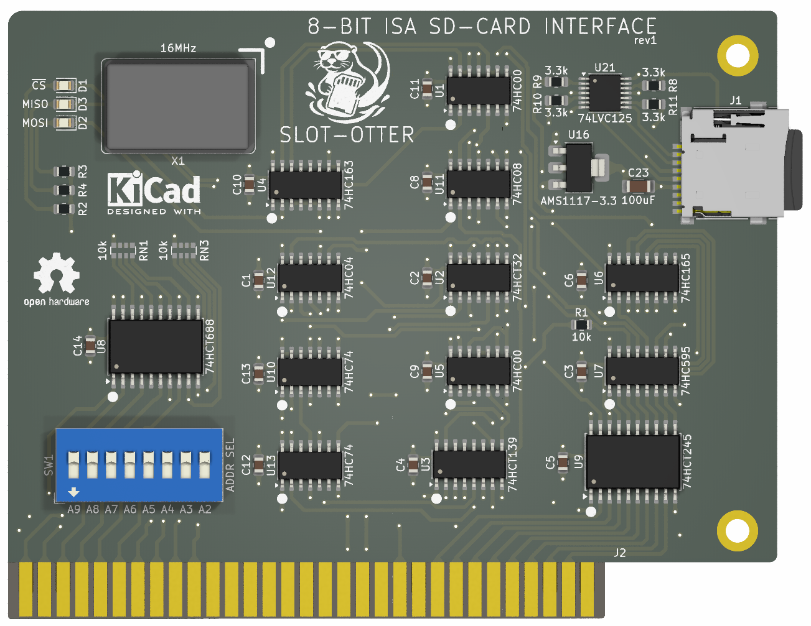
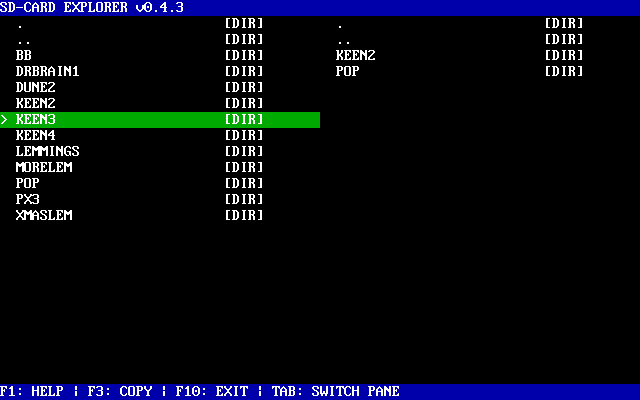

# Slot-otter

A 8-bit ISA card to interface with a FAT32 formatted SD card in MSDOS.

## Software

The main software component of this project is `OTTERNAV.EXE`, a DOS utility
used to navigate the FAT32-formatted SD card and copy files between the SD card
and the system’s hard drive. The program is compiled from source using Borland's
Turbo Assembler v2.0.1 and Turbo C v2.0, classic MS-DOS development tools
originally distributed by Borland Software Corporation. The binaries for these
tools were obtained from [WinWorldPC](https://winworldpc.com/home).

## Downloads

Get the latest pre-built files:

- [OTTERNAV.EXE](https://github.com/ifilot/slot-otter/releases/latest/download/OTTERNAV.EXE)
- [floppy_360k.img](https://github.com/ifilot/slot-otter/releases/latest/download/floppy_360k.img) (5¼" DD)
- [floppy_720k.img](https://github.com/ifilot/slot-otter/releases/latest/download/floppy_720k.img) (3½" DD)
- [floppy_1440k.img](https://github.com/ifilot/slot-otter/releases/latest/download/floppy_1440k.img) (3½" HD)

> You can also browse all releases on the [Releases page](https://github.com/ifilot/slot-otter/releases).

These images can be written directly to physical floppy disks or used with
floppy drive emulators such as GoTek,
[BitstreamBeaver](https://github.com/ifilot/bitstream-beaver) or FlashFloppy for
easy installation on vintage systems.

## Development

For developing the SD-card navigator application, there exists a fork of the
popular MS-DOS emulator [DOSBox](www.dosbox.com) that is able to emulate the
Slot-otter ISA card. More information can be found in 
[this repository](https://github.com/ifilot/dosbox-virtisa).