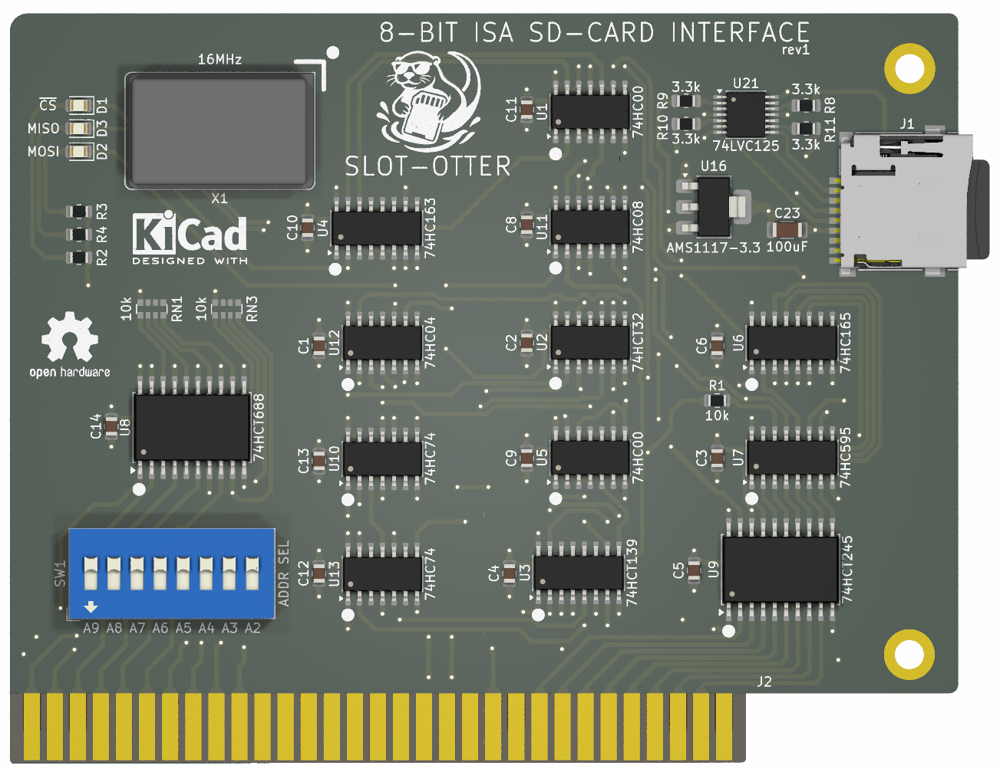

# Slot-otter

[](https://github.com/ifilot/slot-otter/actions/workflows/build.yml)

[](https://www.gnu.org/licenses/gpl-3.0)

An 8-bit ISA card for accessing FAT16- or FAT32-formatted SD cards under MS-DOS.



## Driver

**OTTERSD is the primary software product; 1.0.0 is its first stable release.**
Once loaded, the driver makes the SD card available as an ordinary DOS drive,
such as `S:`. COPY, XCOPY, games and other DOS applications can read and write
files on it. By default, the driver reads back each written block to check
that it was stored correctly. You can also use the card in read-only mode
or unload the driver to free memory for a game.

For browsing and copying files, we recommend
[Nightwatch](https://github.com/ifilot/nightwatch) together with OTTERSD.
Nightwatch is a separate project and is not bundled in these downloads.

OTTERSD is designed for PCs with an 8088/8086 or later processor. It supports
SDHC/SDXC cards formatted as FAT16 or FAT32, using standard 512-byte sectors.
File names follow the usual DOS limit: eight characters for the name and
three for the extension, such as `DUNE2.EXE`. The driver uses approximately
42 KiB of memory while loaded. See the [installation guide](driver/docs/INSTALLATION.md)
for requirements and setup, or [driver documentation](driver/README.md)
for technical details and development.

## Measured transfer speeds

File-copy tests on an **80286 running at 20 MHz** gave these results:

| Direction | FAT16 card | FAT32 card |
| --- | --- | --- |
| To the SD card | 15 KiB/s | 10 KiB/s |
| From the SD card | 38 KiB/s | 38 KiB/s |

These are measured file-transfer speeds, not guaranteed speeds for every
system or card. FAT16 was faster when writing in these tests; reading was
equally fast with both formats.

## Downloads

Get the [latest release](https://github.com/ifilot/slot-otter/releases/latest):

- [OTTERSD-DOS.zip](https://github.com/ifilot/slot-otter/releases/latest/download/OTTERSD-DOS.zip): driver, instructions and license.
- [OTTERSD.EXE](https://github.com/ifilot/slot-otter/releases/latest/download/OTTERSD.EXE): driver executable.
- [floppy_360k.img](https://github.com/ifilot/slot-otter/releases/latest/download/floppy_360k.img): 360 KiB, 5.25-inch DD.
- [floppy_720k.img](https://github.com/ifilot/slot-otter/releases/latest/download/floppy_720k.img): 720 KiB, 3.5-inch DD.
- [floppy_1440k.img](https://github.com/ifilot/slot-otter/releases/latest/download/floppy_1440k.img): 1.44 MiB, 3.5-inch HD.
- [SHA256.TXT](https://github.com/ifilot/slot-otter/releases/latest/download/SHA256.TXT): checksums for checking that downloads are intact.

Floppies contain only the driver, user instructions, configuration example
and license. They contain no testing utilities and are not boot disks.
Write them to physical floppies or use GoTek,
[BitstreamBeaver](https://github.com/ifilot/bitstream-beaver) or FlashFloppy.

## SD-card images

**Recommended: [500 MiB FAT16, 16 KiB clusters](https://github.com/ifilot/slot-otter/releases/latest/download/OTTERSD-FAT16-500MiB.zip).**
This gives a useful balance of storage space and write speed. A cluster is
the unit of space the card assigns to a file. Larger clusters mean less
bookkeeping when growing a file, although small files take up more space.

An alternative [500 MiB FAT32 image with 4 KiB clusters](https://github.com/ifilot/slot-otter/releases/latest/download/OTTERSD-FAT32-500MiB.zip)
is also available. Both images contain an **empty, formatted partition**:
no files or folders. Write an image to your card, copy your files onto it
using a modern PC, then use the card under DOS with OTTERSD.

Extract the ZIP and write its IMG to the **entire card**. This replaces existing
partitions and files: back up first and select the correct device. Do not copy
the IMG as a file or reformat the card afterwards. The image occupies 501 MiB,
including a small area before the 500 MiB partition. On a larger card, the
remaining space is unused by this image. These images hold your files; they
do not boot DOS. Install the driver separately.

## Quick start

Copy OTTERSD.EXE to a directory on your DOS hard drive, such as `C:\OTTERSD`.
Choose an unused drive letter; this example uses `S:`. Add `LASTDRIVE=S` to
CONFIG.SYS (or keep an existing value of S or later), then reboot and load:

```dos
C:\OTTERSD\OTTERSD /DRIVE:S /PORT:330 /RW
```

`/PORT:330` must match the card's port setting; change it if your card uses
a different address. `/RW` enables writing with read-back checks. Omit it
or use `/RO` for read-only access. You can now use commands such as `DIR S:\`.
Add the loading command to AUTOEXEC.BAT if you want it to run at startup.
Run OTTERSD as a program; do not add it as a `DEVICE=` line in CONFIG.SYS.

To free the driver's memory for a game, close programs using the SD card,
switch to your hard drive and run `C:\OTTERSD\OTTERSD /UNLOAD`.
See the [installation guide](driver/docs/INSTALLATION.md) for the full setup
and available options.

## Changing or removing the SD card

**Always unmount before removing a card, and mount again after inserting one.**
Treat this like safely ejecting a card on your modern PC. DOS programs and
the driver can keep file data and information about the card in memory.
Removing or swapping a mounted card can lose changes or cause the driver
to use information belonging to the previous card, risking file corruption.

1. Finish copying and close any programs using the SD card. Return to a
   drive other than the SD card, such as `C:`.
2. Run `C:\OTTERSD\OTTERSD /UNMOUNT`. **Wait for it to succeed before
   removing the card.** If it reports an error, leave the card inserted
   and resolve the error first.
3. Remove the card and insert the card you want to use.
4. Run `C:\OTTERSD\OTTERSD /MOUNT` and wait for it to succeed before
   accessing the SD drive again.

Follow these steps even when reinserting the same card, especially after
changing its contents on another computer. Unmounting leaves the driver
loaded, so you do not need to reboot to change cards.

## Legacy Navigator

OTTERNAV remains available for users of the older software. It accesses the
card directly, without loading OTTERSD. Its source is under [src](src/README.MD), with a separate
[OTTERNAV.EXE download](https://github.com/ifilot/slot-otter/releases/latest/download/OTTERNAV.EXE).
It is not included on the OTTERSD floppies. Unmount OTTERSD before using Navigator
on the same card.

## Development

Standalone driver source, build scripts and regression tests live under
[driver](driver/README.md). Turbo C 2.0 and TASM 2 build the binaries.
[DOSBox-VirtIsa](https://github.com/ifilot/dosbox-virtisa) models the ISA interface;
real DOS kernels and hardware provide additional validation. Developer hardware
kits and test images are separate from public downloads. Disk images,
release packages and build outputs are generated by the tools and GitHub
Actions; they are not stored in the source repository.
